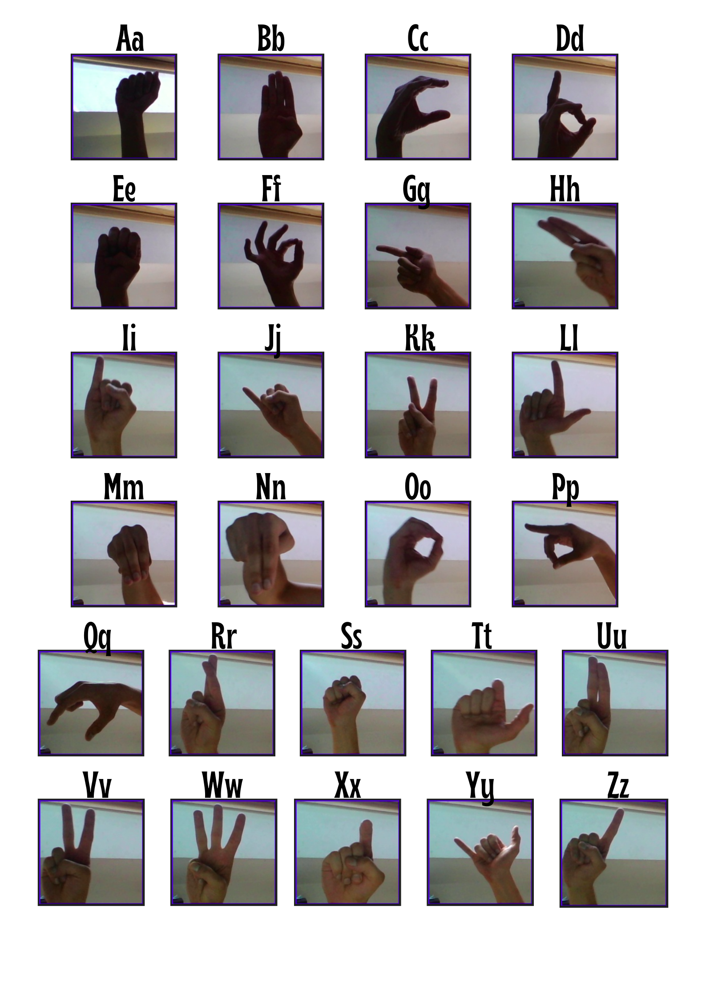

<!-- steps to run simulation
steps to run detection
steps to view result
should include the link to the project article on LinkedIn 
should include unique hand signs for the alphabets (from the dateset)
should include link to the dataset on Kaggle -->

<!-- DOCKER SETUP -->
# GUIDE TO USE THE UHAED PROJECT
This readme document contains everything you need to know to setup and use this repository. 
> NOTE: It is assummed you have an NVIDIA GPU with the driver installed, and you are on an Ubuntu OS (if you want to use Docker). 

> If you do not want to use Docker (even if it is highly recommended), note that the version of gazebo used for this project is Gazebo 7.9.0, on a ROS2 humble framework running on an Ubuntu 22.04.5 LTS OS. The pthon version is Python 3.10.12

For any enquiries, reach out to the developer at [danjuma.deborah505@gmail.com](danjuma.deborah505@gmail.com)

## 1. Setting up Docker 
For a quick setup avoiding dependency issues, it is recommended to use a docker container. The steps to pull the docker image and run the container for this project are provided below:

1. Create a folder on your host system for the workspace called `hri_ws`
2. cd into `hri_ws` folder and create the `src` folder. Then in the `src` folder, clone the repo: `git clone https://github.com/danjayy/uhaed_project`
3. Next, pull the docker image with `docker pull danjayy/uhaed:v1` 
4. To easily run the docker with all settings for display, save this code below in a file called `run_docker.sh`:
```
#!/bin/bash

IMAGE_NAME=${1:-uhaed_sim:humble}
CONTAINER_NAME=${2:-uhaed_sim_cont}


# Hook to the current SSH_AUTH_LOCK - since it changes
# https://www.talkingquickly.co.uk/2021/01/tmux-ssh-agent-forwarding-vs-code/
ln -sf $SSH_AUTH_SOCK ~/.ssh/ssh_auth_sock

# Allowing permissions for host workspace
sudo chmod -R a+rwX "/path/to/your/workspace/hri_ws"

xhost +local:root && docker run \
  -it \
  --device=/dev/video0:/dev/video0 \
  --device=/dev/video1:/dev/video1 \
  -e XDG_RUNTIME_DIR=/tmp/runtime-root \
  --volume="/tmp/.X11-unix:/tmp/.X11-unix" \
  --env="XAUTHORITY=$XAUTHORITY" \
  -e NVIDIA_DRIVER_CAPABILITIES=all \
  --runtime=nvidia \
  --gpus all \
  -v /dev/input:/dev/input \
  -v /dev/tty:/dev/tty \
  -v "/path/to/your/workspace/hri_ws:/root/hri_ws:rw" \
  --network=host \
  --privileged \
  --volume ~/.ssh/ssh_auth_sock:/ssh-agent \
  --env SSH_AUTH_SOCK=/ssh-agent \
  --env DISPLAY=$DISPLAY \
  --env TERM=xterm-256color \
  --name $CONTAINER_NAME \
  $IMAGE_NAME \
```
> **NOTE**: replace "/path/to/your/workspace/hri_ws" in the code snippet (both places) above with the path to the `hri_ws` folder on your host system.

5. Then, cd into the the folder where the `run_docker.sh` folder is stored, and run: `bash run_docker.sh`
6. The docker container should be running now. (you can subsequently restart the docker container with: `docker start -i uhaed_sim_cont`)
7. In the running container, build the workspace (`hri_ws`) with: `colcon build --symlink-install` and source it with: `source install/setup.bash`


## Run the classroom simulation on Gazebo
To run the gazebo simulation, simply launch: `ros2 launch sim_environment classroom.launch.py`

## Run ASL Detection
To understand the architecture used to train the model in this project, check out this [article](linkedin link).
The ASL signs used in the [training dataset](https://www.kaggle.com/datasets/debashishsau/aslamerican-sign-language-aplhabet-dataset), which will be used with the `detection` package, have some discrepancies in certain letters with the popular ASL signs. For this reason, the signs used in the dataset are provided in the image below:


To run the simulation: 
> NOTE: it is assumed that you have setup the docker container (if using Docker) using the steps mentioned in the previous section, or you have setup your workspace and cloned this repository (if not using Docker).

1. In the docker container, install the following libraries:

| Library | Command |
|---------|---------|
| pip     | `python3 -m pip install --upgrade pip` |
| numpy   | `pip install numpy==2.1.2` |
| pytorch     | `pip install torch==2.9.1` |
| torchvision     | `pip install torchvision==0.24.1` |
| opencv     | `pip install opencv-python==4.12.0` |
| mediapipe     | `python -m pip install mediapipe==0.10.31` |
| PIL     | `python3 -m pip install --upgrade Pillow`|

2. Run the detection node with: `ros2 run detection asl_recognition_node`

3. In another terminal, run `ros2 run rqt_image_view` and set the topic to '/output'. This gui will be used to view the predicted image of the letter whose sign you make to the camera.

4. In another terminal, run `ros2 run rqt_image_view` and set the topic to '/debug_image'. This gui will be used to see the hand which is being used for prediction currently and the percentage accuracy of the letter's prediction.


<!-- CLASSROOM SIMULATION STEPS -->
